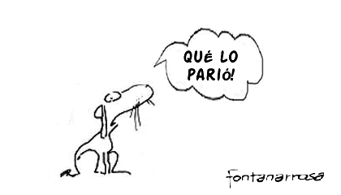

:title: Phasety ♥ IDTQ
:data-transition-duration: 1000
:css: hovercraft.css

**************
Phasety ♥ IDTQ
**************

Una presentación para decir
----------------------------

*y viceversa*
-------------

por **Martín Gaitán**

----

A modo de pedido de disculpas
-----------------------------

.. image:: img/tw.png
   :align: center

----

¿Qué es *Phasety*?
-------------------

.. epigraph::

   Los científicos estudian lo que es. Los ingenieros crean **lo que nunca ha sido**

   -- Theodore von Karman

----

Lo que *nunca* ha sido
--------------------------------

| Crear EBTs a partir de conocimiento especializado
| No es común en Argentina
| Pero ahora *hay condiciones propicias*
| Phasety, creada por ingenieros aprendiendo sobre la marcha lo que la universidad
  no les enseñó (*¿Por qué?*)

----

¿Qué es una EBT?
-----------------

.. epigraph::

   "Son aquellas empresas en las que parte o todo el proceso productivo
   sucede en el cerebro de sus trabajadores"

   -- Dr. Lino Baraño, Ministro de Ciencia y tecnología.

----

No me chamuyei negro ¿Qué lo que hacei en *faseti*?
---------------------------------------------------

.. epigraph::

   "Uno vende humo"

   -- Dr. Daniel Pusiol

----

De paso, bonito el logo, no?
----------------------------

.. image:: img/logo.png
   :align: center

----

*************
¿Qué hacemos?
*************

----

Consultoría en termodinámica
----------------------------

  Somos (*dijo el mosquito*) especialistas en equilibrio de fases y  modelado termodinámico

----

Software científico
-------------------

  Utilizamos tecnologías modernas y probadas para el desarrollo de software de simulación y visualización

----

Aplicado a la industria del petróleo
------------------------------------

  A través de socios estratégicos, sabemos (*dijeron los mosquitos*) qué necesita la industria

----

******************
Nuestros objetivos
******************

----

  | Ser felices
  | Crear una empresa sustentable
  | Que de (mucho) trabajo de calidad
  | Que aporte a la soberanía tecnológica del país
  | y de yapa *ser líderes de Latinoamérica en lo que hacemos*

(Mosquitos agrandados)

----

************************
Ajá. Y cómo empezó esto?
************************

----

:data-scale: 0.1

| 80's: Cismondi dejó de comer carne y se volvió ñoño
| 2000/2005: Doctorado en Plapiqui e IVP-SEP (Dinamarca)
| 2006: Tesis (Nace GPEC)
| 2009: Curso Michelsen (Los tortolitos se conocen)
| 2010: Renace GPEC (Tesis de este negrito)
| 2011: Marcelo Crotti - INLAB
| 2012: PICT Start Up + **Incubadora UNC!**

------

Es 2013, ¿por dónde andán?
--------------------------

Transitando el valle de la muerte

------

****************************
¿Hay posibilidades de éxito?
****************************

----

.. image:: img/calsep.jpg

----

.. image:: img/hydra.png

----

.. image:: img/cmg.png

------

¿Pero en Argentina?
-------------------

----

Empretecno cierra en **2 semanas**

.. image:: img/face.png

----

¿Qué proyectos hay en curso?
----------------------------

GPEC (debuggeado y relanzado) y Johannes

----

***************************************************
¿Y el petróleo lo untan en el sanguche vegetariano?
***************************************************

----

*¡Calmaos!* (pero no tanto)

| No es soplar y hacer... equilibrios de fase
| Hace falta **conocer** qué hace falta hacer
| Asegurarnos (lo que podamos) que **podemos hacerlo**
| y tener recursos para hacerlo.

----

***********************************
Estamos resolviendo todo eso junto
***********************************

Y juntos

.. image:: img/todos.jpg

----

*************************
Hasta ahora de qué comen?
*************************

----

| Del aire
| Padrinazgo (finalizado) de INLAB
| Aporte caritativo de Papá Gaitán
| Bolsillos propios (te quiero Machinalis, te quiere Conicet)
| y un poco de PICT (el poco que era para esto, no?)

    < $2000/mes **¡Mosquitos!**

----

**********************
¿De qué piensan comer?
**********************

----

Hasta que pasemos el valle...

| GPEC Pro / Johannes
| Fonsoft
| Empretecno (crucen los dedos)
  (*también los de las patas*)
| Trabajitos y consolutoriítas
| Vuelva a la diapositiva anterior

----

**********************************
IDTQ querido, Phasety está contigo
**********************************

| Phasety nació gracias a IDTQ
| Podemos (y queremos) trabajar *codo a codo*
| Con transparencia y buena leche
| Inspiración: LCD + Clariphy + Fundación Tarpuy
| Prestigio p/Phasety, nuevas puertas p/IDTQ

----

*****************************
Ideas para el
*****************************

***************
"*y viceversa*"
***************

----

**Ahora**

| Trabajemos en Johannes colaborativamente
| Capacitaciones comunes (Python!)
| "Hola empresa, te presento a IDTQ"
| Comamo'un asado, tomemo un ferné

----

**Después**

| Becas Doc cofinanciadas
| Cursos pagos para 3ros codictados
| Consultorías/desarrollos de IDTQ para Phasety
| Alternativa laboral a postdoc/conicet (?)
| Comamo'un asado, tomemo un ferné

----

Son las 4:45am.

----

Entonces...

******************
¿ IDTQ ♥ Phasety ?
******************
