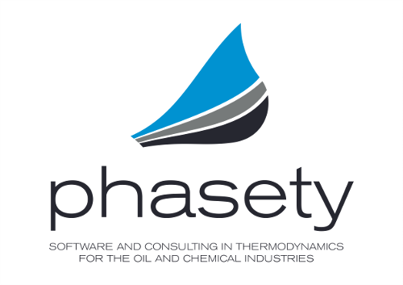
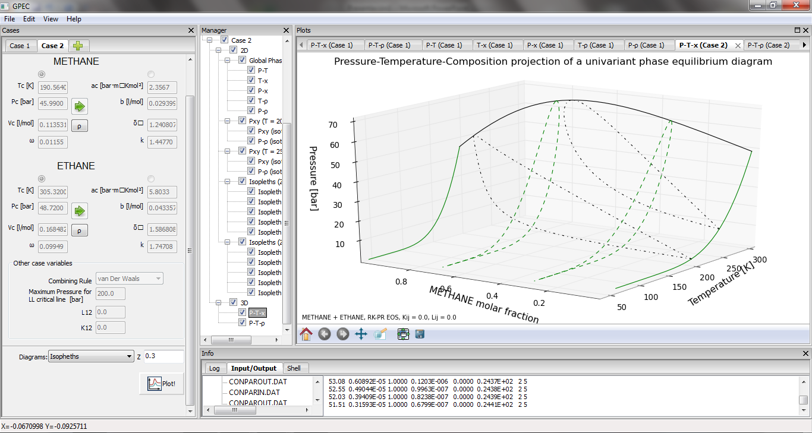
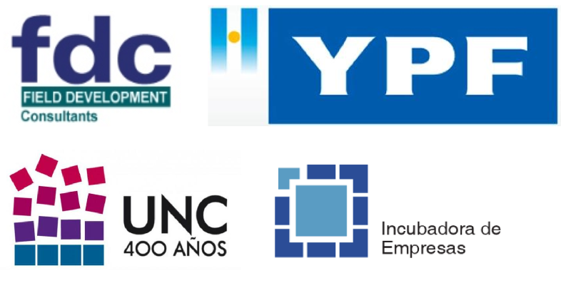

:title: Phasety en 5 minutos
:data-transition-duration: 1500
:css: hovercraft.css

**********************
Phasety (en 5 minutos)
**********************

Incubadora de Empresas
-----------------------

Universidad Nacional de Córdoba
--------------------------------

4 de julio de 2013

----

Software y consultoría en termodinámica para la industria del petróleo

----

| Crear EBTs a partir de conocimiento especializado
| y vincular la ciencia con la industria
| No era común en Argentina
| Pero ahora *hay condiciones propicias*

----

¿Qué sabemos hacer?
-------------------

- Modelado termodinámico (equilibrio de fases)
- Métodos numéricos
- ¡Gráficos, muchos gráficos!
- Software científico... apto para petroleros

----

¿Quiénes somos?
----------------

.. image:: img/todos.jpg

.. note::

    - Martín Cismondi, doctor en ingenieria Quimica,
      especialista en modelado termodinámico reconocido internacionalmente
    - Martín Gaitan, experto en ingeniería de software
    - Equipo de profesionales con talento, que comparten el entusiasmo

----

Nuestro caso de éxito: GPEC
----------------------------

.. note::

        - Software para el cálculo y graficación de diagramas de fase de sistemas binarios
        - Tesis doctoral de Cismondi y *refactoring* de Gaitán
        - GPEC es usado en muchas universidades y grupos de investigación del mundo
        - Experiencia de trabajo

----

¿Hacia dónde vamos?
---------------------

**PVT-Sur**: El primer simulador PVT de Latinoamérica

.. note:: Un simulador PVT es una herramienta para la toma de decisiones
          de ingenieria en petróleo. Ejemplo: dimensionamiento de plantas de superificie,
          estrategia de producción, prevención de formación de sólidos, etc.

----

No estamos solos
----------------

.. note:: FDC

----

Queremos...
------------

| Ser la "Calsep" de Sudámerica
| Ser una EBT sustentable (trabajo de calidad)
| Aportar a la soberanía tecnológica del país

----

**************
Muchas Gracias
**************